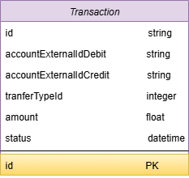
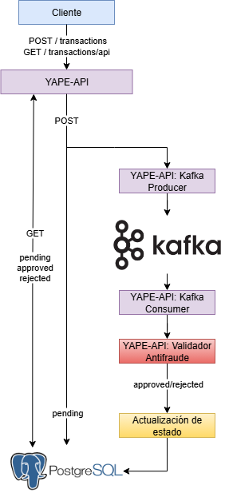
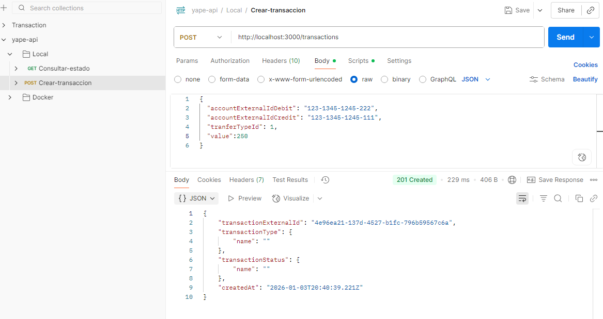
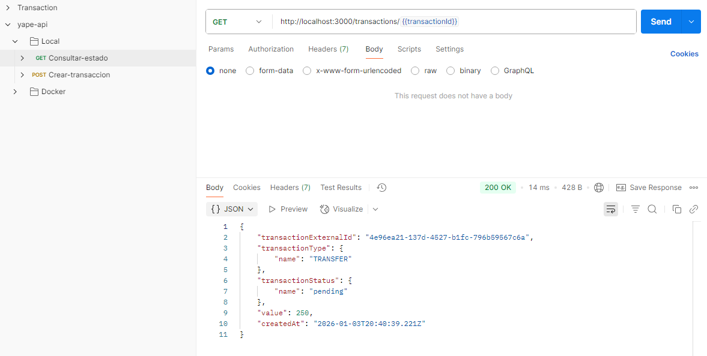
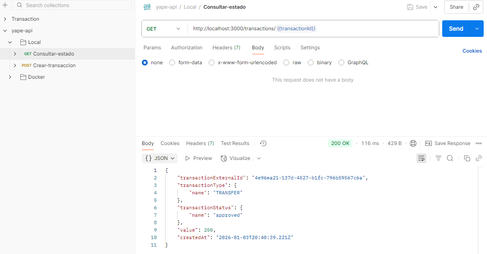
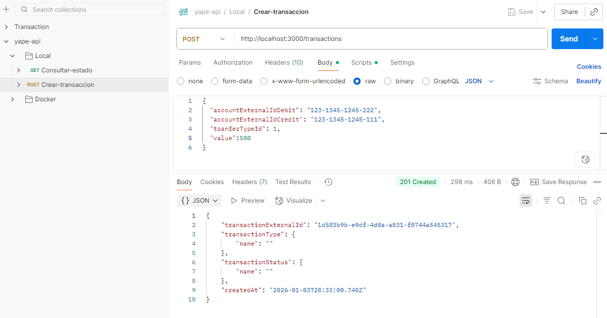
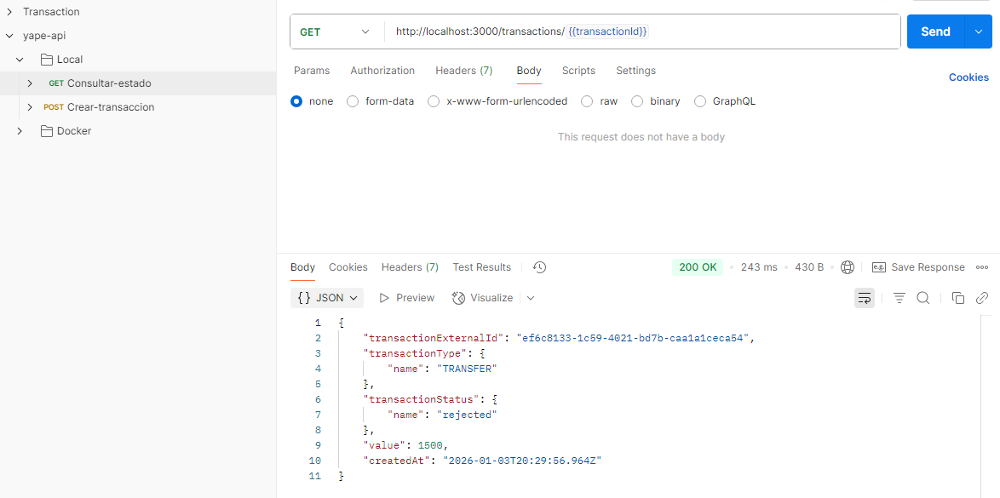
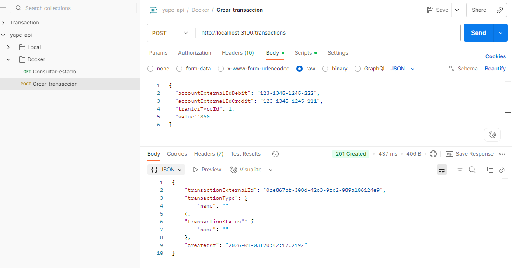
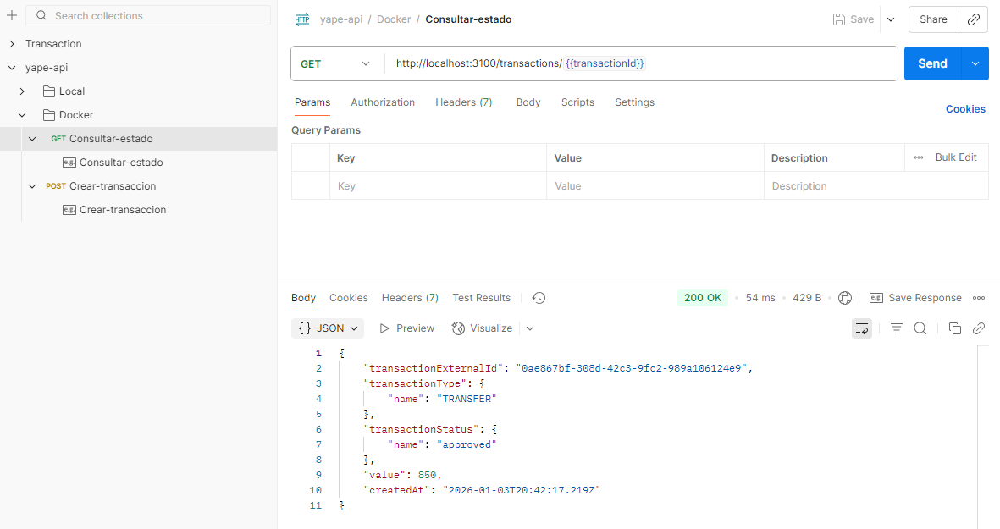

# Yape Code Challenge 🚀

Microservicio de **transacciones financieras** con validación antifraude usando **Node.js, Prisma, PostgreSQL y Kafka**.
Cada transacción sigue un flujo de estados: `pending`, `approved` o `rejected`.

## 📑 Table of Contents

1. [Prerequisites](#prerequisites)
2. [Clone repository](#clone-repository)
3. [Running Services](#running-services)
4. [Local Installation](#local-installation)
5. [Running API with Docker](#running-api-with-docker)
6. [Endpoints](#endpoints)
7. [Testing](#testing)
8. [Pending Tasks and Delays](#pending-tasks-and-delays)
9. [Swagger Documentation](#swagger-documentation)
10. [Important Modifications and Commands](#important-modifications-and-commands)
11. [Additional Resources](#additional-resources)
12. [Optional: High Volume Scenarios](#optional-high-volume-scenarios)
13. [Testing Postman](#testing-postman)

## 🛠 Prerequisites

* Node.js ≥ 20
* Docker + Docker Compose
* Git
* Conocimientos básicos de las API REST

## 🔗 Clone repository

Clonar el repositorio:

```
git clone https://github.com/yaperos/app-nodejs-codechallenge.git
cd app-nodejs-codechallenge
```

## 🐳 Running Services

Iniciar los servicios: PostgreSQL, Zookeeper, Kafka

```
docker compose up -d postgres zookeeper kafka
```

## 📦 Local Installation

1. Instalar dependencias:

```
npm install
```

2. Inicializar Prisma:

```
npx prisma generate
npx prisma migrate dev --name init
```

⚠️ Si ya había datos en la base de datos:

```
npx prisma migrate reset
npx prisma migrate dev --name init
```

## 🐳 Running API with Docker

Iniciar el api: Api

```
docker compose up -d api
```

Revisar los registros de tu API (esperar el mensaje de inicio)

```
docker logs -f yape-api
```

Debería mostrar:

```
🚀 Server running on port 3100
```

Una vez iniciadas, las API estarán disponibles en:

```
http://localhost:3100/transactions
http://localhost:3100/transactions/{{transactionId}}
http://localhost:3100/api-docs
```

## 📍 Running API with Local

Servidor normal

```
npm run dev
```

Servidor con 5 segundos de retraso en la validación antifraude

```
Modifique .env como sigue: DELAY_MS="0"
npm run dev
```

Servidor predeterminado: http://localhost:3000

## 📡 Endpoints

1. Cree una transacción (POST /transactions):

```
{
"accountExternalIdDebit": "123-1345-1245-222",
"accountExternalIdCredit": "123-1345-1245-111",
"tranferTypeId": 1,
"value": 500
}
```

Responses:

```
201 Created
{
"transactionExternalId": "d6d95759...",
"transactionType": { "name": "" },
"transactionStatus": { "name": "" },
"value": 500,
"createdAt": "2026-01-03T09:04:41.455Z"
}

400 Bad Request
{
"message": "Missing required fields"
}
```

2. Verificar el estado de una transacción (GET /transactions/:transactionId):

```
200 OK
{
"transactionExternalId": "d6d95759...",
"transactionType": { "name": "TRANSFER" },
"transactionStatus": { "name": "approved" },
"value": 500,
"createdAt": "2026-01-03T09:04:41.455Z"
}

404 Not Found
{
"message": "Transaction not found"
}
```

Nota: `transactionStatus.name` puede ser `pending`, `approved` o `rejected`

## 🧪 Testing

Ejecutar pruebas

```
npm test
```

## ⏳ Pending Tasks and Delays

Simular transacciones pendientes con retraso

```
Modificar .env como sigue: DELAY_MS="0"
npm run dev
```

## 📖 Swagger Documentation

Archivo de configuración

```
src/swagger-docs/transactions.js
```

Acceder a la documentación

```
Docker: http://localhost:3000/api-docs
Local: http://localhost:3100/api-docs
```

## ⚡ Important Modifications and Commands

Cada vez que se actualiza schema.prisma

```
npx prisma migrate dev
npx prisma generate
```

Scripts en package.json

```
"dev": "nodemon src/server.js",
"test": "jest"
```

## 🔗 Additional Resources

Colección de Postman

[yape-api.postman_collection.json](./backup/yape-api.postman_collection.json)

- **Modelo de base de datos**


- **Arquitectura del api**


Nota: Asegúrese de que PostgreSQL y Kafka se estén ejecutando antes de usar la colección.

## 💡 Optional: High Volume Scenarios

Para escenarios con **alto volumen de transacciones**, se podrían considerar las siguientes estrategias:

1. **Bases de datos optimizadas para escritura concurrente**:
   - Usar particionamiento para distribuir la carga.
   - Indexar solo los campos necesarios para reducir overhead(carga adicional) en escrituras masivas.

2. **Cache para lecturas frecuentes**:
   - Implementar Redis para consultas rápidas del estado de transacciones recientes.

3. **Event-driven architecture**:
   - Kafka ya ayuda a desacoplar el servicio de validación antifraude y permite manejar picos altos de mensajes sin bloquear el API principal.
   - Se pueden usar **topics separados por tipo de transacción** para balancear la carga.

5. **Batch processing y colas**:
   - Procesar transacciones en batches cuando el volumen sea muy alto, reduciendo overhead(carga adicional) de la base de datos.


----------------------------------------------------------------------
## 🔗 Testing Postman

- **LOCAL**













- **DOCKER**



